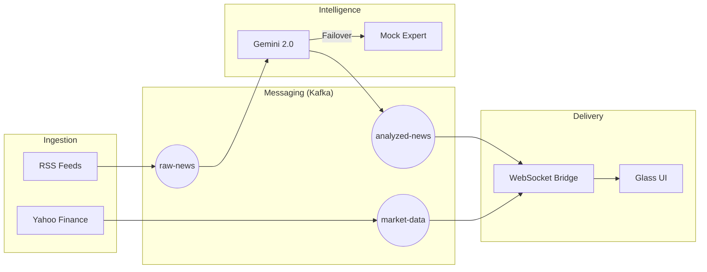

# 🏗️ Rapport d'Architecture Système (V1.2)

## Vue d'Ensemble
L'architecture de **Forex Sentinel** est conçue pour la haute disponibilité et l'intelligence distribuée. Chaque composant fonctionne de manière autonome, communiquant via des messages asynchrones.

## Diagramme des Flux

## Innovations Techniques
1. **Double Moteur IA** : Utilisation prioritaire du LLM Gemini 2.0 pour l'analyse sémantique, avec bascule automatique sur un moteur de règles expert (Mock) pour garantir la continuité de service.
2. **Persistence Data-Lake** : Archivage en temps réel dans MongoDB Atlas via un worker dédié pour l'analyse historique ultérieure.
3. **Optimisation WebSocket** : Utilisation de `asyncio.run_coroutine_threadsafe` pour une communication fluide entre les threads de calcul et la boucle d'événements asynchrone de FastAPI.
